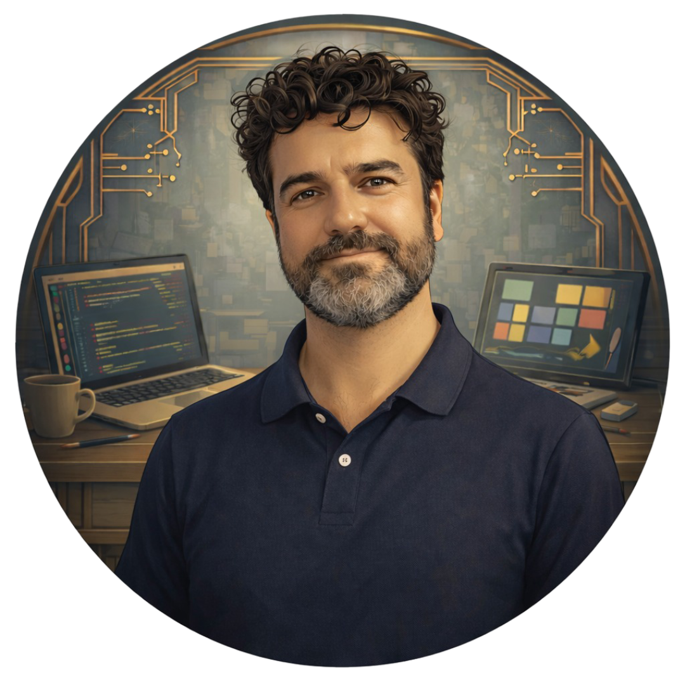

# Jean-Matthieu Hervoche

  

<table border="0">
  <tr>
    <td width="75%">
      <h1>Développeur Logiciel & Web</h1>
      <h3>Spécialisation Data & IA</h3>
      
<b>Ancien dirigeant d'entreprise en reconversion stratégique vers l'ingénierie logicielle.</b>

      
Après 20 ans d'expérience en gestion, je mets ma rigueur et ma culture du résultat au service du développement. Étudiant à l'<b>École 42 Angoulême</b>, je combine expertise technique (C/C++, TS) et vision métier.

    </td>
    <td width="25%" align="center">
      
    </td>
  </tr>
</table>

---

##   Profil 
- **Capacité d'adaptation :** Habitué à recruter et former des équipes (5 à 10 saisonniers par an) dans des environnements exigeants.
- **Culture du résultat :** Orienté vers la création d'outils fiables, maintenables et créateurs de valeur.
- **Engagement :** En recherche d'une **alternance (contrat de professionnalisation) dès avril 2026** pour préparer un titre RNCP 7.

---

##  Compétences Techniques

  
  
   
   
       
    
 

- **Langages & Systèmes :** C et C++ (avancé) pour la performance et la gestion réseau.
- **Blockchain :** Développement de smart contracts en **Solidity** sur Avalanche.
- **Web & Qualité :** TypeScript, Fastify, et automatisation via GitHub Actions (CI/CD).
- **Outils :** Docker, Linux, Git, et environnement de développement optimisé (VS Code/Neovim).
- **AI & Data :** `AWS Certified AI Practitioner`, `Ollama integration`, `Data Processing`

---

##  Projets Phares

###  [ft_IRC](https://github.com/jmtth/ft_IRC) (C++)
Implémentation d'un serveur de messagerie conforme à la RFC 2812.
- **Collaboration :** Utilisation de `clang-tidy`, `clangd` et gestion rigoureuse par `Pull Requests`.
- **Innovation :** Intégration d'un bot via **Ollama**.

###  [Transcendance](https://github.com/jmtth/transcendence) (Fullstack & Blockchain)
Plateforme web avec authentification et sockets temps réel.
- **Blockchain :** Enregistrements immuables sur **Avalanche** via **Solidity**.
- **Qualité :** Pipeline robuste avec `ESLint`, `Husky`, `Commitlint` et tests via `Vitest`.

---

##  Statistiques GitHub

---

##  Me contacter
- 💼 **LinkedIn :** [Mon profil professionnel](https://linkedin.com/in/jean-matthieu-hervoche-8a850a304/)
- 📍 **Localisation :** Royan / Angoulême
- 📧 **Email :** *Disponible sur mon CV ou via LinkedIn pour éviter le spam.*
---
*"Apprendre, s'adapter, transmettre."*