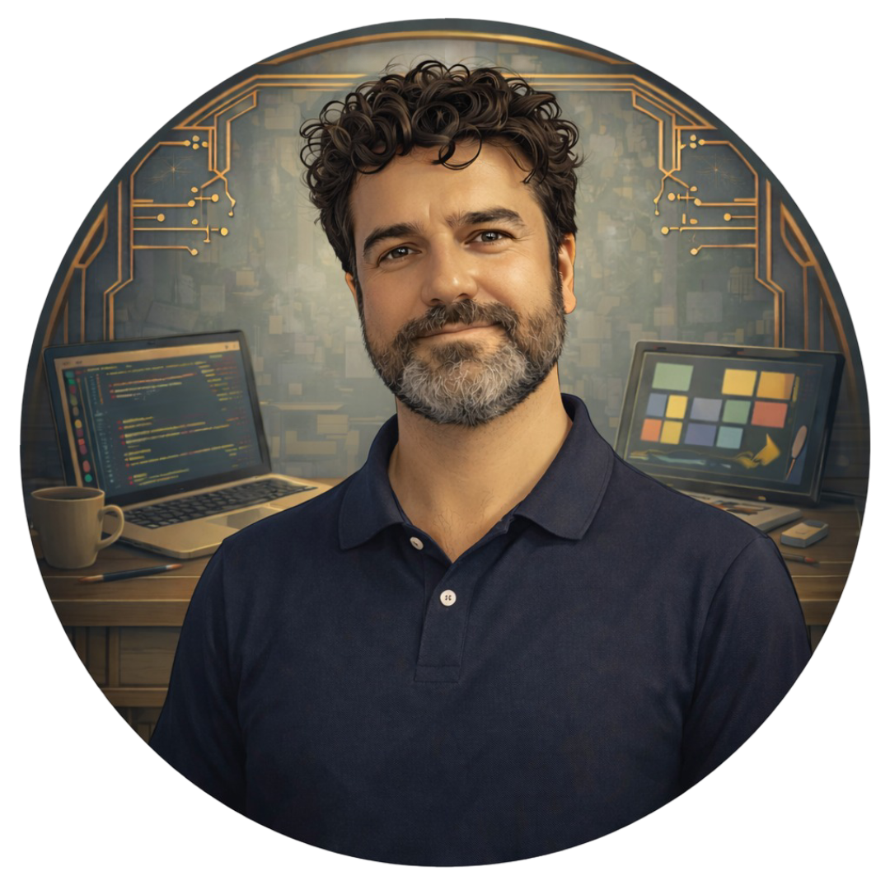
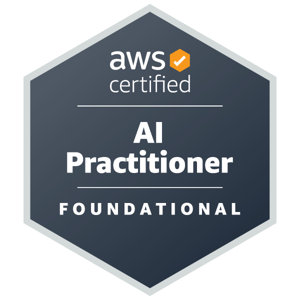

# Jean-Matthieu Hervoche

  

<table border="0">
  <tr>
    <td width="75%">
      <h1>Développeur Fullstack – Backend & Data</h1>
      <h3>Alternance RNCP 7 (Bac + 5 / Master) | Web · Data · IA</h3>
      
<b>Ancien dirigeant d'entreprise en reconversion stratégique vers l'ingénierie logicielle.</b>

      

        Après plus de 20 ans d’expérience en environnement concurrentiel, je me spécialise
        dans le développement backend, les architectures API et la manipulation de données.
        Étudiant à l’<b>École 42 Angoulême</b>, je combine rigueur technique
        (C / C++, TypeScript, Node.js) et forte compréhension des enjeux métier.
      

    </td>
    <td width="25%" align="center">
      
    </td>
  </tr>
</table>

---

##   Profil 
- **Trajectoire professionnelle atypique :** ancien entrepreneur, habitué aux environnements exigeants et aux contraintes métier.
- **Orientation backend & data :** conception d’API, structuration des données, qualité et fiabilité des flux.
- **Capacité d'adaptation :** Habitué à recruter et former des équipes (5 à 10 saisonniers par an) dans des environnements exigeants.
- **Culture du résultat :** Orienté vers la création d'outils fiables, maintenables et créateurs de valeur.
- **Objectif :** recherche d’une **alternance RNCP 7 (contrat de professionnalisation de deux ans)** à partir d’**avril ou septembre 2026**.

---

##  Compétences Techniques

  
  
   
   
       
     
 

### Backend & Data
- Conception d’API REST et WebSocket (Node.js / Fastify)
- Modélisation et exploitation de bases de données SQL
- Qualité, sécurité et maintenabilité des services

### Langages & Systèmes
- **C / C++ :** programmation système, réseau, performance (Valgrind)
- **TypeScript :** services backend et logique applicative (Vitest)
- **Solidity :** sur Avalanche (Foundry, Hardhat)

### DevOps & Qualité
- Docker, Linux (Alpine, Ubuntu)
- CI/CD (GitHub Actions), Git, workflows collaboratifs

### IA (usage raisonné)
- **AWS Certified AI Practitioner**
- Intégration locale d’IA (Ollama), automatisation et aide au traitement des données

---

##  Projets Phares (Focus Rigueur & Data)

###  [ft_IRC](https://github.com/jmtth/ft_IRC) (C++)
*L'excellence du bas niveau au service de la communication.*
- **Challenge :** Recréer un serveur IRC conforme à la RFC 2812 sans bibliothèques externes.
- **Expertise :** Gestion fine de la mémoire, multiplexage de sockets (`poll()`), et architecture client-serveur robuste.
- **Rigueur :** Respect strict de la norme C++98, zéro fuite mémoire.
- **Programmation réseau** bas niveau (sockets TCP)
- **Gestion de la concurrence** et des états clients
- **Collaboration :** Utilisation de `clang-tidy`, `clangd` et gestion rigoureuse par `Pull Requests`.
- **Innovation :** Intégration d'un bot via **Ollama**.

###  [Transcendance](https://github.com/jmtth/transcendence) SaaS & Blockchain (Fullstack)
L'immuabilité des données au cœur d'une application web.*
- **Innovation :** Utilisation d'**Avalanche** et **Solidity** pour la persistance des scores et données critiques.
- **Backend :** API haute performance avec Fastify et authentification sécurisée.
- **DevOps :** Pipeline CI/CD complet (GitHub Actions) et conteneurisation Docker.
- **Qualité :** Pipeline robuste avec `ESLint`, `Husky`, `Commitlint` et tests via `Vitest`.

---

## Au-delà du Code
Mon parcours d'ancien gérant de SARL me permet d'aborder chaque projet avec une vision **ROI (Retour sur Investissement)**. 
Je ne me contente pas de livrer du code "qui marche", je conçois des outils **maintenables, documentés et scalables**.

##  Statistiques GitHub

##  Me contacter
-  **LinkedIn :** [Mon profil professionnel](https://linkedin.com/in/jean-matthieu-hervoche/)
-  **Localisation :** Royan / Angoulême
-  **Email :** *Disponible sur mon CV ou via LinkedIn pour éviter le spam.*
-  

---
*"Apprendre, s'adapter, transmettre."*
